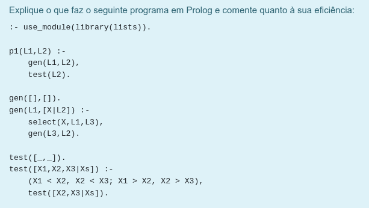
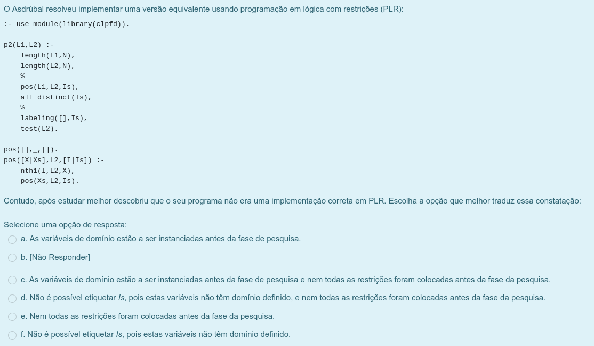

### Ex.1

O programa recebe duas listas, remove uma ocorrência de todos os elementos da segunda lista que apareçam na primeira e depois verifica se a segunda lista está ordenada por ordem crescente ou decrescente.

### Ex.2

a) ou c)

### Ex.3

### Ex.4
